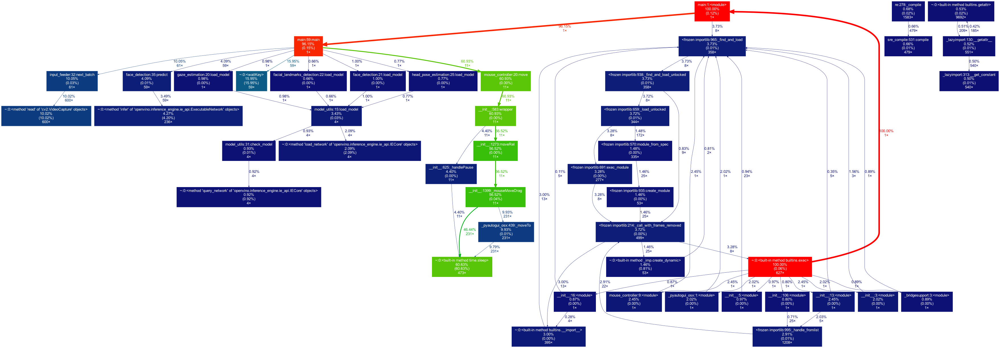

# Computer Pointer Controller

### Overview: Computer Pointer Controller
In this project, gaze detection model has been used to control the mouse pointer of your computer. You will be using the Gaze Estimation model to estimate the gaze of the user's eyes and change the mouse pointer position accordingly. This project will demonstrate the ability to run multiple models in the same machine and coordinate the flow of data between those models.

## Project Set Up and Installation


### Setting up Virtual Environment 

The code uses a virtual environment for project isolation , for the purpose of isolation 'Conda' has been used

Installation of conda 

https://docs.conda.io/projects/conda/en/latest/user-guide/install/#installing-in-silent-mode


Creating and Activating the environment 

`conda create --name udacity_openvino_cpc_proj python=3.6`

once created , activate the environment with

`conda activate udacity_openvino_cpc_proj`

install the required modules using 

`pip3 install -r requirements.txt`

Download the following models by using openVINO model downloader:-

**1. Face Detection Model**
```
python /opt/intel/openvino/deployment_tools/tools/model_downloader/downloader.py --name "face-detection-adas-binary-0001"
```
**2. Facial Landmarks Detection Model**
```
python /opt/intel/openvino/deployment_tools/tools/model_downloader/downloader.py --name "landmarks-regression-retail-0009"
```
**3. Head Pose Estimation Model**
```
python /opt/intel/openvino/deployment_tools/tools/model_downloader/downloader.py --name "head-pose-estimation-adas-0001"
```
**4. Gaze Estimation Model**
```
python /opt/intel/openvino/deployment_tools/tools/model_downloader/downloader.py --name "gaze-estimation-adas-0002"
```

## Demo

To run the model pipeline , execute the following model ,

`python3 src/main.py -f models/intel/face-detection-adas-binary-0001/FP32-INT1/face-detection-adas-binary-0001.xml -l models/intel/landmarks-regression-retail-0009/FP16/landmarks-regression-retail-0009.xml -hp models/intel/head-pose-estimation-adas-0001/FP16/head-pose-estimation-adas-0001.xml -g models/intel/gaze-estimation-adas-0002/FP16/gaze-estimation-adas-0002.xml -i bin/demo.mp4 -d CPU -v all --path FP16`


## Documentation
Here are the command line arguments


Argument|Type|Description
| ------------- | ------------- | -------------
-f | Required | Path to .xml file of Face Detection model.
-f | Required | Path to .xml file of Facial Landmark Detection model.
-hp| Required | Path to .xml file of Head Pose Estimation model.
-g| Required | Path to .xml file of Gaze Estimation model.
-i| Required | Specify the path of input video file or enter cam for taking input video from webcam.
-d | Optional | Provide the target device: CPU / GPU / MYRIAD / FPGA
-t  | Optional | Probability threshold for detections filtering.
-v | Optional | See detailed output of selected models. "Valid inputs: 'landmark', 'headpose' , 'gaze' or 'all'
--path  | Optional | filename to store the benchmark data for comparison (fps , model load time, inference time)

python3 src/main.py -f models/intel/face-detection-adas-binary-0001/FP32-INT1/face-detection-adas-binary-0001.xml -l models/intel/landmarks-regression-retail-0009/FP16/landmarks-regression-retail-0009.xml -hp models/intel/head-pose-estimation-adas-0001/FP16/head-pose-estimation-adas-0001.xml -g models/intel/gaze-estimation-adas-0002/FP16/gaze-estimation-adas-0002.xml -i bin/demo.mp4 -d CPU -v all --path FP16

## Benchmarks
Benchmark results of running the model across different model precisions. this includes include: model loading time, input/output processing time, model inference time etc.


FPS           | Inference Time |  Model Load Time
:-------------------------:|:-------------------------:|:-------------------------:
  |  |  


## Results

Following is the output ,


## Learning on the Behavior of different precisions

Here is a quick profiling of different precision to understand the difference in performance ,

``` 
python -m cProfile -s tottime  -o fp16_bm_output.pstats src/main.py -f models/intel/face-detection-adas-binary-0001/FP32-INT1/face-detection-adas-binary-0001.xml -l models/intel/landmarks-regression-retail-0009/FP16/landmarks-regression-retail-0009.xml -hp models/intel/head-pose-estimation-adas-0001/FP16/head-pose-estimation-adas-0001.xml -g models/intel/gaze-estimation-adas-0002/FP16/gaze-estimation-adas-0002.xml -i bin/demo.mp4 -d CPU -v all --path FP16 
```

To visual the pstats file and see the performance stats as an image, we need graphviz and we can install by the following command.

`brew install graphviz`

### FP16
```
gprof2dot -f pstats output.pstats | dot -Tpng -o output.png
```


similarly running the benchmark across other precision renders the following output.

### FP32-INT8
```
gprof2dot -f pstats fp32i8_bm_output.pstats | dot -Tpng -o fp32i8_bm_output.png 
```




### FP32

```
gprof2dot -f pstats fp32_bm_output.pstats | dot -Tpng -o fp32_bm_output.png 
```


By profile and sorting the 'total time' using the following command 

```
python -m cProfile -s tottime src/main.py -f models/intel/face-detection-adas-binary-0001/FP32-INT1/face-detection-adas-binary-0001.xml -l models/intel/landmarks-regression-retail-0009/FP32-INT8/landmarks-regression-retail-0009.xml -hp models/intel/head-pose-estimation-adas-0001/FP32-INT8/head-pose-estimation-adas-0001.xml -g models/intel/gaze-estimation-adas-0002/FP32-INT8/gaze-estimation-adas-0002.xml -i bin/demo.mp4 -d CPU -v all --path FP32-INT8  >> fp32i8_bm_output.log
```

And noticed the following results


# FP16

|ncalls | tottime | percall  |cumtime | percall| filename:lineno(function)|
| ------ | -------| -------| ------ | -------| ------- |
|   600  |  2.509  |  0.004   | 2.509  |  0.004 | {method 'read' of 'cv2.VideoCapture' objects} |
|53/25  |  2.129  |  0.040   | 2.341  | 0.094 | {built-in method _imp.create_dynamic} |
|  236  |  1.052  |  0.004   | 1.072  | 0.005 | {method 'infer' of 'openvino.inference_engine.ie_api.ExecutableNetwork' objects} |
|    4  |  0.669   | 0.167   | 0.669  | 0.167 | {method 'query_network' of 'openvino.inference_engine.ie_api.IECore' objects} |
|    4  |  0.457  |  0.114   | 0.457  | 0.114 | {method 'load_network' of 'openvino.inference_engine.ie_api.IECore' objects} |
|   61  |  0.253   | 0.004   | 2.762  | 0.045 | input_feeder.py:32(next_batch) |
    
## FP32 

|ncalls | tottime | percall  |cumtime | percall| filename:lineno(function)|
| ------ | -------| -------| ------ | -------| ------- |
|    600  |  2.472 |   0.004  |  2.472 |   0.004 | {method 'read' of 'cv2.VideoCapture' objects}|
|      236 |   1.036 |   0.004 |   1.055|    0.004 | {method 'infer' of 'openvino.inference_engine.ie_api.ExecutableNetwork' objects}|
|        4 |   0.421 |   0.105 |   0.421 |   0.105 | {method 'load_network' of 'openvino.inference_engine.ie_api.IECore' objects}|
|    53/25  |  0.190  |  0.004 |   0.355  |  0.014 |{built-in method _imp.create_dynamic}|
|        4  |  0.153  |  0.038 |   0.153   | 0.038 | {method 'query_network' of 'openvino.inference_engine.ie_api.IECore' objects}|
|       59  |  0.087  |  0.001 |   0.087   | 0.001 | {imshow}|
|        4  |  0.077  |  0.019 |   0.077   | 0.019 | {method 'read_network' of 'openvino.inference_engine.ie_api.IECore' objects}|

## FP32-INT8 

|ncalls | tottime | percall  |cumtime | percall| filename:lineno(function)|
| ------ | -------| -------| ------ | -------| ------- |
|     600  |  2.444 |   0.004   | 2.444  |  0.004 |{method 'read' of 'cv2.VideoCapture' objects}|
|      236  |  1.065 |   0.005   | 1.085  |  0.005 | {method 'infer' of 'openvino.inference_engine.ie_api.ExecutableNetwork' objects}|
|        4  |  0.534  |  0.134   | 0.534  |  0.134 |{method 'load_network' of 'openvino.inference_engine.ie_api.IECore' objects}|
|        4  |  0.234  |  0.059   | 0.234  |  0.059 |{method 'query_network' of 'openvino.inference_engine.ie_api.IECore' objects}|
|    53/25  |  0.208  |  0.004   | 0.392  |  0.016 |{built-in method _imp.create_dynamic}|
|        4  |  0.095  |  0.024   | 0.095  |  0.024 |{method 'read_network' of 'openvino.inference_engine.ie_api.IECore' objects}|
   


